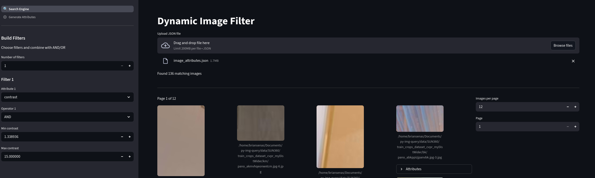
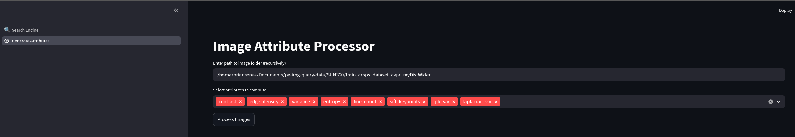

# Image Attribute Explorer

A **Streamlit application** for exploring and measuring image attributes. This tool allows users to **visualize images dynamically** and filter them based on attributes.
It also allows the **computation** of said attributes (such as contrast, laplacian, lbp, sift...)

---
### 1. Visualize Images with Filters

* Dynamically browse images with **AND/OR filtering** on attributes.
* Smaller images are displayed in a **grid with pagination**.
* Filters can be numeric, boolean, or exact-match.
* In the following example you can see images of low quality being filtered:



---

### 2. Measure Image Attributes

* Select a folder (or multiple images) to measure attributes recursively.
* Choose which attributes to compute.
* Generates a **JSON file** with computed values per image.



---

## ⚙️ Installation

```bash
git clone https://github.com/briansenas/py-img-query#
cd py-img-query
uv venv ./venv
source .venv/bin/activate
uv sync
```

If you are going to develop, remember to install `pre-commit` (`pre-commit install`).

## 🚀 Running the Application

```bash
streamlit run app.py
```

This will launch the app in your default browser at `http://localhost:8501`.

## 📦 Project Structure

```
image-attribute-explorer/
├── app.py                     # Main Streamlit app
├── pages/
│   ├── visualize.py           # Visualization logic
│   └── measure_attributes.py  # Attributes measurement logic
└── README.md
```

---

## 💡 Tips for Users
* When measuring attributes for large folders, **start with a subset** to test.

# TODO List
## 1. Build Image Filter Page
- [x] Sidebar filters with AND/OR logic
- [x] Numeric, boolean, and exact-match inputs
- [x] Pagination for images
- [x] Smaller images in grid layout

## 2. Build Image Attribute Measurement Page
- [x] Select folder or multiple images
    - [ ] Improve this by having a folder selection UI
- [x] Choose which attributes to compute
- [x] Generate JSON file per image
- [x] Download or save JSON locally

## 3. Improve UX
- I really need to learn how to design stuff....

## 4. New Functionality
- [X] **Build `select_images(filters)` function**
    - Improve it by allow mouse click / drag?

## 5. Development & Maintenance
- [ ] Everything is a mess tbh

## 6. Optional Enhancements
- Add more image attributes that could be useful... need to investigate
- Optimize image attributes measurements... I've only tested a subset and it takes sooo long.
    - Multiprocessing will have a great impact here
